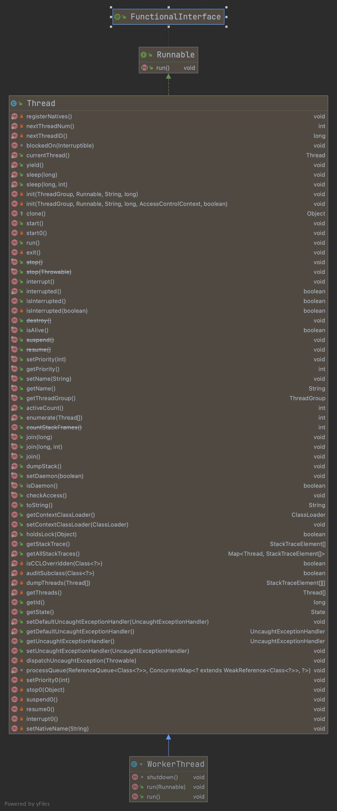
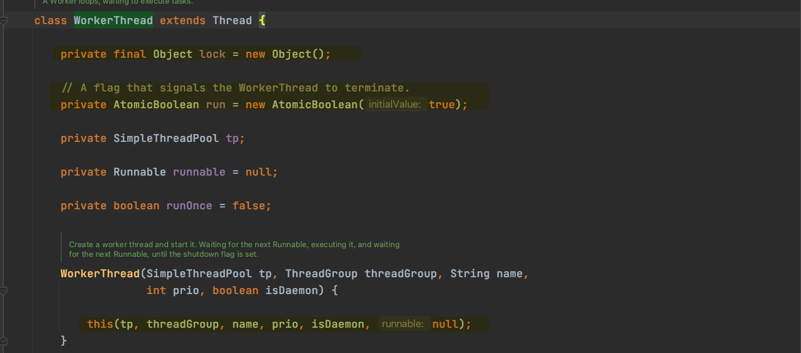
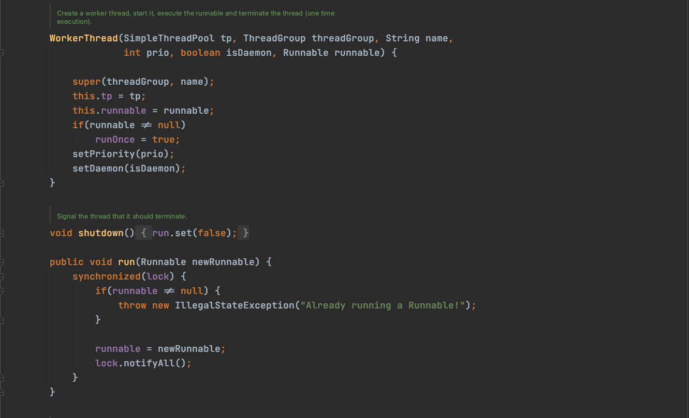

#定时任务quartz 源码分析

***
##Scheduler---接口
StdScheduler---子类

***
##SchedulerFactory---接口#工厂
StdSchedulerFactory---子类

*** 
##Remote---接口

RemotableQuartzScheduler---子类

QuartzScheduler---子类|核心类

>This is the heart of Quartz, an indirect implementation of the Scheduler interface, 
>containing methods to schedule Jobs, register JobListener instances, etc.

***
##JobDetail
JobDetailImpl

***
##Trigger---接口#触发器

CronTrigger---接口#cron触发器
CronTriggerImpl

CalendarIntervalTrigger
DailyTimeIntervalTrigger
SimpleTrigger

TriggerBuilder---触发器构造器
ScheduleBuilder

CronScheduleBuilder
org.quartz.CronScheduleBuilder

CalendarIntervalScheduleBuilder

DailyTimeIntervalScheduleBuilder
SimpleScheduleBuilder

***
#监听器
ListenerManager

SchedulerListener

JobListener

TriggerListener

***
#辅助类

QuartzSchedulerResources---配置集成类

##线程组
ThreadPool

SimpleThreadPool

WorkerThread---内部类#工作线程
>org.quartz.simpl.SimpleThreadPool.WorkerThread

run()

QuartzSchedulerThread

ExecutingJobsManager

SchedulerSignaler

ThreadExecutor

WorkManagerThreadExecutor

SchedulerContext
