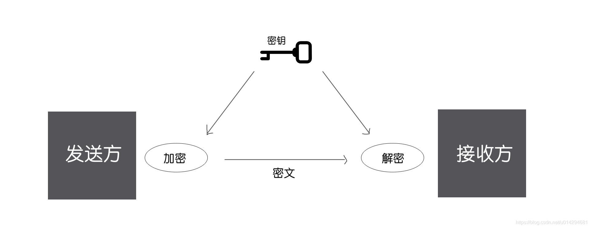

#对称加密算法 (DES、3DES、AES、RC)

这篇文章来讲讲对称加密，对称加密在开发中用的很多，
如 AES，DES，3DES，RC。

##目录:

- 介绍
- 优点和缺点
- DES算法
- 3DES算法
- AES算法
- RC算法

### 1. 介绍

#### 1.1 概念
采用单钥密码系统的加密方法，同一个密钥用来加密和解密，常见的对称加密算法有 DES，3DES，AES，RC2，RC4，RC5等。

#### 1.2 工作过程

### 2. 优点和缺点

优点：

加密计算量小，速度快，适合对大量数据进行加密的场景。比如前面讲的网络篇 - https协议中的数据是否需要二次加密中就有提到过，证书的传递用的非对称加密，数据传递用的是对称加密。

缺点：

密钥传输问题：如上所说，由于对称加密的加密和解密使用的是同一个密钥，所以对称加密的安全性就不仅仅取决于加密算法本身的强度，更取决于密钥是否被安全的保管，因此加密者如何把密钥安全的传递到解密者手里，就成了对称加密面临的关键问题。（比如，我们客户端肯定不能直接存储对称加密的密钥，因为被反编译之后，密钥就泄露了，数据安全性就得不到保障，所以实际中我们一般都是客户端向服务端请求对称加密的密钥，而且密钥还得用非对称加密加密后再传输）
密钥管理问题：再者随着密钥数量的增多，密钥的管理问题会逐渐显现出来。比如我们在加密用户的信息时，不可能所有用户都用同一个密钥加密解密，这样的话，一旦密钥泄漏，就相当于泄露了所有用户的信息，因此需要为每一个用户单独的生成一个密钥并且管理，这样密钥管理的代价也会非常大。

### 3. DES算法

DES 全称 Data Encryption Standard，是一种使用密钥加密的块算法。现在认为是一种不安全的加密算法，因为现在已经有用穷举法攻破 DES 密码的报道了。尽管如此，该加密算法还是运用非常普遍，是一种标准的加密算法，3DES 是 DES 的加强版本。

DES 加密算法出自 IBM 的研究，后来被美国政府正式采用，之后开始广泛流传，但是近些年使用越来越少，因为 DES 使用56位密钥（密钥长度越长越安全），以现代计算能力24小时内即可被破解。虽然如此，在某些简单应用中，我们还是可以使用 DES 加密算法。

DES 算法的入口参数有三个：Key、Data、Mode。

Key 是 DES 算法的工作密钥。
Data 是要被加密或被解密的数据。
Mode 为 DES 的工作方式，有两种：加密或解密。

    private static final String ALGO = "DES";
    private static byte[] encrypt(byte[] src, String password) {
        try {
            // DES 算法要求有一个可信任的随机数源
            SecureRandom random = new SecureRandom();
            DESKeySpec desKey = new DESKeySpec(password.getBytes());
            // 创建一个密匙工厂，然后用它把 DESKeySpec 转换成 SecretKey
            SecretKeyFactory keyFactory = SecretKeyFactory.getInstance(ALGO);
            SecretKey securekey = keyFactory.generateSecret(desKey);
            // Cipher对象实际完成加密操作
            Cipher cipher = Cipher.getInstance(ALGO);
            // 用密匙初始化 Cipher 对象，ENCRYPT_MODE 用于将 Cipher 初始化为加密模式的常量
            cipher.init(Cipher.ENCRYPT_MODE, securekey, random);
            // 加密数据
            return cipher.doFinal(src);
        } catch (Throwable e) {
            e.printStackTrace();
        }
        return null;
    }
 
    private static byte[] decrypt(byte[] src, String password) {
        try {
            // DES 算法要求有一个可信任的随机数源
            SecureRandom random = new SecureRandom();
            // 创建一个 DESKeySpec 对象
            DESKeySpec desKey = new DESKeySpec(password.getBytes());
            // 创建一个密匙工厂
            SecretKeyFactory keyFactory = SecretKeyFactory.getInstance(ALGO);
            // 将 DESKeySpec 对象转换成 SecretKey 对象
            SecretKey securekey = keyFactory.generateSecret(desKey);
            // Cipher 对象实际完成解密操作
            Cipher cipher = Cipher.getInstance(ALGO);
            // 用密匙初始化 Cipher 对象
            cipher.init(Cipher.DECRYPT_MODE, securekey, random);
            // 解密数据
            return cipher.doFinal(src);
        } catch (Throwable e) {
            e.printStackTrace();
        }
        return null;
    }
 
    public static void main(String[] args) {
        String psw = "12345678";
        String data = "hello Test symmetric encry";
        byte[] encryData = encrypt(data.getBytes(), psw);
        System.out.println("encryData = " + new String(encryData));
        byte[] decryData = decrypt(encryData, psw);
        System.out.println("decryData = " + new String(decryData));
    }
执行输出：

>encryData =  ��1��z|}�ּ4a&\�[?��0�*P�O�

>decryData = hello Test symmetric encry

注意，密钥必须是8的倍数，否则会报 java.security.InvalidKeyException: Wrong key size。DES 标准密钥就是56位，8个字符即8个字节，每个字节的最高位不用，即每个字节只用7位，8个字符正好是56位。

### 4. 3DES算法

3DES（或称为 Triple DES）是三重数据加密算法（TDEA，Triple Data Encryption Algorithm）块密码的通称。它相当于是对每个数据块应用三次 DES 加密算法。由于计算机运算能力的增强，原版 DES 密码的密钥长度变得容易被暴力破解；3DES 即是设计用来提供一种相对简单的方法，即通过增加 DES 的密钥长度来避免类似的攻击，而不是设计一种全新的块密码算法。

3DES（即Triple DES）是 DES 向 AES 过渡的加密算法，它使用3条56位的密钥对数据进行三次加密，是 DES 的一个更安全的变形。它以 DES 为基本模块，通过组合分组方法设计出分组加密算法。比起最初的 DES，AES 更为安全。

DES -> 3DES -> AES。

    private static final String Algorithm = "DESede";
 
    /**
     * 加密数据
     *
     * @param keybyte keybyte为加密密钥，长度为24字节
     * @param src 加密数据源
     */
    private static byte[] encrypt(byte[] keybyte, byte[] src) {
        try {
            // 生成密钥
            SecretKey deskey = new SecretKeySpec(keybyte, Algorithm);
            Cipher c1 = Cipher.getInstance(Algorithm);
            c1.init(Cipher.ENCRYPT_MODE, deskey);
            // 加密数据
            return c1.doFinal(src);
        } catch (java.security.NoSuchAlgorithmException e1) {
            e1.printStackTrace();
        } catch (javax.crypto.NoSuchPaddingException e2) {
            e2.printStackTrace();
        } catch (java.lang.Exception e3) {
            e3.printStackTrace();
        }
        return null;
    }
 
    /**
     * 解密数据
     *
     * @param keybyte keybyte为加密密钥，长度为24字节
     * @param src 解密数据源
     */
    private static byte[] decrypt(byte[] keybyte, byte[] src) {
        try {
            // 生成密钥
            SecretKey deskey = new SecretKeySpec(keybyte, Algorithm);
            Cipher c1 = Cipher.getInstance(Algorithm);
            c1.init(Cipher.DECRYPT_MODE, deskey);
            // 解密
            return c1.doFinal(src);
        } catch (java.security.NoSuchAlgorithmException e1) {
            e1.printStackTrace();
        } catch (javax.crypto.NoSuchPaddingException e2) {
            e2.printStackTrace();
        } catch (java.lang.Exception e3) {
            e3.printStackTrace();
        }
        return null;
    }
 
    public static void main(String[] args) {
        // 添加新安全算法，如果用JCE就要把它添加进去
        Security.addProvider(new com.sun.crypto.provider.SunJCE());
        // 24字节的密钥
        final byte[] keyBytes = {
                0x11, 0x22, 0x4F, 0x58,
                (byte) 0x88, 0x10, 0x40, 0x38,
                0x28, 0x25, 0x79, 0x51,
                (byte) 0xCB, (byte) 0xDD, 0x55, 0x66,
                0x77, 0x29, 0x74, (byte) 0x98,
                0x30, 0x40, 0x36, (byte) 0xE2
        };
 
        String szSrc = "hello Test symmetric encry";
        byte[] encryData = encrypt(keyBytes, szSrc.getBytes());
        System.out.println("encryData: " + new String(encryData));
 
        byte[] decryptData = decrypt(keyBytes, encryData);
        System.out.println("decryptData: " + (new String(decryptData)));
    }

3DES 的密钥长度为24个字节，而 DES 的密钥长度为8的倍数，比如8，16，24都可以。

### 5. AES算法

上面讲了 DES 加密算法、3DES 加密算法等，但是因为 AES 加密算法的安全性要高于 DES 和 3DES，所以 AES 已经成为了主要的对称加密算法。AES 加密算法就是众多对称加密算法中的一种，它的英文全称是 Advanced Encryption Standard，翻译过来是高级加密标准，它是用来替代之前的 DES 加密算法的。
AES 加密算法采用`分组密码体制`，每个分组数据的长度为128位16个字节，密钥长度可以是128位16个字节、192位或256位，一共有四种加密模式，我们通常采用需要初始向量 IV 的 CBC 模式，初始向量的长度也是128位16个字节。

AES 加密的五个关键词，分别是：
- 分组密码体制
- Padding
- 密钥
- 初始向量 IV 
- 四种加密模式

#### 5.1 分组密码体制
>所谓分组密码体制就是指将明文切成一段一段的来加密，然后再把一段一段的密文拼起来形成最终密文的加密方式。

AES 采用分组密码体制，即 AES 加密会首先把明文切成一段一段的，而且每段数据的长度要求必须是128位16个字节，如果最后一段不够16个字节了，就需要用 Padding 来把这段数据填满16个字节，然后分别对每段数据进行加密，最后再把每段加密数据拼起来形成最终的密文。

#### 5.2 Padding
> Padding 就是用来把不满16个字节的分组数据填满16个字节用的，它有三种模式` PKCS5、PKCS7 和NOPADDING`。

    PKCS5 是指分组数据缺少几个字节，就在数据的末尾填充几个字节的几，比如缺少5个字节，就在末尾填充5个字节的5。
    PKCS7 是指分组数据缺少几个字节，就在数据的末尾填充几个字节的0，比如缺少7个字节，就在末尾填充7个字节的0。
    NoPadding 是指不需要填充，也就是说数据的发送方肯定会保证最后一段数据也正好是16个字节。

>那如果在PKCS5 模式下，最后一段数据的内容刚好就是16个16怎么办？那解密端就不知道这一段数据到底是有效数据还是填充数据了，因此对于这种情况，PKCS5 模式会自动帮我们在最后一段数据后再添加16个字节的数据，而且填充数据也是16个16，这样解密段就能知道谁是有效数据谁是填充数据了。PKCS7 最后一段数据的内容是16个0，也是同样的道理。解密端需要使用和加密端同样的 Padding 模式，才能准确的识别有效数据和填充数据。我们开发通常采用 PKCS7 Padding 模式。

#### 5.3 初始向量IV
>初始向量 IV 的作用是使加密更加安全可靠，我们使用 AES 加密时需要主动提供初始向量，而且只需要提供一个初始向量就够了，后面每段数据的加密向量都是前面一段的密文。初始向量 IV 的长度规定为128位16个字节，初始向量的来源为随机生成。至于为什么初始向量能使加密更安全可靠，会在下面的加密模式中提到。

#### 5.4 密钥
AES 要求密钥的长度可以是128位16个字节、192位或者256位，位数越高，加密强度自然越大，但是加密的效率自然会低一些，因此要做好衡量。我们开发通常采用128位16个字节的密钥，我们使用 AES 加密时需要主动提供密钥，而且只需要提供一个密钥就够了，每段数据加密使用的都是这一个密钥，密钥来源为随机生成（我们开发时传入的那个为初始密钥，除了初始密钥以外，后面每一轮的密钥都是由上一轮的密钥扩展而来的，密钥扩展有四个步骤：排列、置换、与轮常量异或、生成下一轮密钥的其他列）。

#### 5.5 四种加密模式
AES 一共有四种加密模式， 分别是 
- ECB（电子密码本模式）
- CBC（密码分组链接模式）
- CFB
- OFB
>我们一般使用的是 CBC 模式。四种模式中除了 ECB 相对不安全之外，其它三种模式的区别并没有那么大（ECB 模式是最基本的加密模式，即仅仅使用明文和密钥来加密数据，相同的明文块会被加密成相同的密文块，这样明文和密文的结构将是完全一样的，就会更容易被破解，相对来说不是那么安全，因此很少使用，而 CBC 模式则比 ECB 模式多了一个初始向量 IV，加密的时候，第一个明文块会首先和初始向量 IV 做异或操作，然后再经过密钥加密，然后第一个密文块又会作为第二个明文块的加密向量来异或，依次类推下去，这样相同的明文块加密出的密文块就是不同的，明文的结构和密文的结构也将是不同的，因此更加安全，我们常用的就是 CBC 加密模式）。

AES 流程图：

    private static final String ALGO = "AES/ECB/PKCS5Padding";
 
    public static byte[] encrypt(String data, Key key) {
        try {
            Cipher cipher = Cipher.getInstance(ALGO);
            cipher.init(cipher.ENCRYPT_MODE, key);
            return cipher.doFinal(data.getBytes());
        } catch (Throwable throwable) {
            throwable.printStackTrace();
        }
        return null;
    }
 
    private static byte[] decrypt(byte[] result, Key key) {
        try {
            Cipher cipher = Cipher.getInstance(ALGO);
            cipher.init(Cipher.DECRYPT_MODE, key);
            return cipher.doFinal(result);
        } catch (Throwable throwable) {
            throwable.printStackTrace();
        }
        return null;
    }
 
    private static Key createKey() {
        try {
            // 生成key
            KeyGenerator keyGenerator;
            // 构造密钥生成器，指定为AES算法,不区分大小写
            keyGenerator = KeyGenerator.getInstance("AES");
            // 生成一个128位的随机源,根据传入的字节数组
            keyGenerator.init(128);
            // 产生原始对称密钥
            SecretKey secretKey = keyGenerator.generateKey();
            // 获得原始对称密钥的字节数组
            byte[] keyBytes = secretKey.getEncoded();
            // key转换,根据字节数组生成AES密钥
            return new SecretKeySpec(keyBytes, "AES");
        } catch (NoSuchAlgorithmException e) {
            e.printStackTrace();
            return null;
        }
    }
 
    public static void main(String[] args) {
        String data = "hello Test symmetric encry";
        Key key = createKey();
        byte[] encryData = encrypt(data, key);
        System.out.println("encryData = " + new String(encryData));
        byte[] decryData = decrypt(encryData, key);
        System.out.println("decryData = " + new String(decryData));
    }
执行输出：

encryData = ,A��8�dZ�|o��Wʏ�i"���K�
decryData = hello Test symmetric encry

6. RC算法

包括RC2，RC4，RC5。

RC2 是由著名密码学家 Ron Rivest 设计的一种传统对称分组加密算法，它可作为 DES 算法的建议替代算法。它的输入和输出都是64bit。密钥的长度是从1字节到128字节可变，但目前的实现是8字节（1998年）。

RC4 于1987年提出，和 DES 算法一样，是一种对称加密算法，也就是说使用的密钥为单钥（或称为私钥）。但不同于 DES的是，RC4 不是对明文进行分组处理，而是字节流的方式依次加密明文中的每一个字节，解密的时候也是依次对密文中的每一个字节进行解密。

RC4 算法的特点是算法简单，运行速度快，而且密钥长度是可变的，可变范围为1-256字节（8-2048bit），在如今技术支持的前提下，当密钥长度为128bit时，用暴力法搜索密钥已经不太可行，所以可以预见 RC4 的密钥范围任然可以在今后相当长的时间里抵御暴力搜索密钥的攻击。实际上，如今也没有找到对于128bit密钥长度的 RC4 加密算法的有效攻击方法。

RC5 分组密码算法是1994由麻萨诸塞技术研究所的 Ronald L. Rivest 教授发明的，并由 RSA 实验室分析。它是参数可变的分组密码算法，三个可变的参数是：分组大小、密钥大小和加密轮数。在此算法中使用了三种运算：异或、加和循环。

来看一个 RC4 的例子：

package io.kzw.advance.csdn_blog;

public class RC4 {

    public static String decry_RC4(byte[] data, String key) {
        if (data == null || key == null) {
            return null;
        }
        return asString(RC4Base(data, key));
    }
 
    public static String decry_RC4(String data, String key) {
        if (data == null || key == null) {
            return null;
        }
        return new String(RC4Base(HexString2Bytes(data), key));
    }
 
    public static byte[] encry_RC4_byte(String data, String key) {
        if (data == null || key == null) {
            return null;
        }
        byte b_data[] = data.getBytes();
        return RC4Base(b_data, key);
    }
 
    public static String encry_RC4_string(String data, String key) {
        if (data == null || key == null) {
            return null;
        }
        return toHexString(asString(encry_RC4_byte(data, key)));
    }
 
 
    private static String asString(byte[] buf) {
        StringBuffer strbuf = new StringBuffer(buf.length);
        for (int i = 0; i < buf.length; i++) {
            strbuf.append((char) buf[i]);
        }
        return strbuf.toString();
    }
 
    private static byte[] initKey(String aKey) {
        byte[] b_key = aKey.getBytes();
        byte state[] = new byte[256];
 
        for (int i = 0; i < 256; i++) {
            state[i] = (byte) i;
        }
        int index1 = 0;
        int index2 = 0;
        if (b_key == null || b_key.length == 0) {
            return null;
        }
        for (int i = 0; i < 256; i++) {
            index2 = ((b_key[index1] & 0xff) + (state[i] & 0xff) + index2) & 0xff;
            byte tmp = state[i];
            state[i] = state[index2];
            state[index2] = tmp;
            index1 = (index1 + 1) % b_key.length;
        }
        return state;
    }
 
    private static String toHexString(String s) {
        String str = "";
        for (int i = 0; i < s.length(); i++) {
            int ch = (int) s.charAt(i);
            String s4 = Integer.toHexString(ch & 0xFF);
            if (s4.length() == 1) {
                s4 = '0' + s4;
            }
            str = str + s4;
        }
        // 0x表示十六进制
        return str;
    }
 
 
    private static byte[] HexString2Bytes(String src) {
        int size = src.length();
        byte[] ret = new byte[size / 2];
        byte[] tmp = src.getBytes();
        for (int i = 0; i < size / 2; i++) {
            ret[i] = uniteBytes(tmp[i * 2], tmp[i * 2 + 1]);
        }
        return ret;
    }
 
    private static byte uniteBytes(byte src0, byte src1) {
        char _b0 = (char) Byte.decode("0x" + new String(new byte[]{src0}))
                .byteValue();
        _b0 = (char) (_b0 << 4);
        char _b1 = (char) Byte.decode("0x" + new String(new byte[]{src1}))
                .byteValue();
        byte ret = (byte) (_b0 ^ _b1);
        return ret;
    }
 
    private static byte[] RC4Base(byte[] input, String mKkey) {
        int x = 0;
        int y = 0;
        // 这边将密钥确保为 256 个字节
        byte key[] = initKey(mKkey);
        int xorIndex;
        byte[] result = new byte[input.length];
 
        for (int i = 0; i < input.length; i++) {
            x = (x + 1) & 0xff;
            y = ((key[x] & 0xff) + y) & 0xff;
            byte tmp = key[x];
            key[x] = key[y];
            key[y] = tmp;
            xorIndex = ((key[x] & 0xff) + (key[y] & 0xff)) & 0xff;
            result[i] = (byte) (input[i] ^ key[xorIndex]);
        }
        return result;
    }
}

调用：

    public static void main(String[] args) {
        String data = "hello Test symmetric encry";
        String secretKey = "0123456789abcdef";
        byte[] encryData = RC4.encry_RC4_byte(data, secretKey);
        System.out.println("encryData = " + new String(encryData));
        String decryData = RC4.decry_RC4(encryData, secretKey);
        System.out.println("decryData = " + decryData);
    }
执行输出：

,5�n��z�z��> ��A��T�    �?
decryData = hello Test symmetric encry
————————————————
版权声明：本文为CSDN博主「Tony-老师」的原创文章，遵循CC 4.0 BY-SA版权协议，转载请附上原文出处链接及本声明。
原文链接：https://blog.csdn.net/u014294681/article/details/86690241

