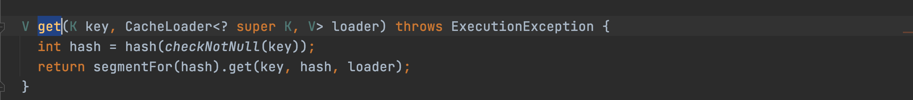

#guava-cache

##1. CacheBuilder---构建类

| field | comment |
| ----- |   --    |

###1.1 方法列表

####builder 方法

### 1.2 辅助类

#### 1.2.1 RemovalListener---接口#监听

#### Weigher---接口#权重

#### CacheStats---

#### Ticker---抽象类#心跳

>A time source; returns a time value representing the number of nanoseconds elapsed since some fixed but arbitrary point in time. Note that most users should use Stopwatch instead of interacting with this class directly

#### Equivalence ---
#### Suppliers---

#### StatsCounter---内部接口#监控
>com.google.common.cache.AbstractCache.StatsCounter

#### CacheLoader---接口#业务加载接口

***

##2. Cache---顶层接口 

###2.1 LoadingCache---子接口

#### 2.1.1 方法
##### get

###2.2 LocalManualCache---静态内部类
>com.google.common.cache.LocalCache.LocalManualCache

####2.2.1 LocalLoadingCache---内部静态子类

>com.google.common.cache.LocalCache.LocalLoadingCache

##### get---获取

##3. LocalCache---核心类#Map

### getOrLoad---查询

### get

### hash

###rehash

### 辅助类
#### Segment---内部静态类#段

>com.google.common.cache.LocalCache.Segment

#####get---方法#获取

