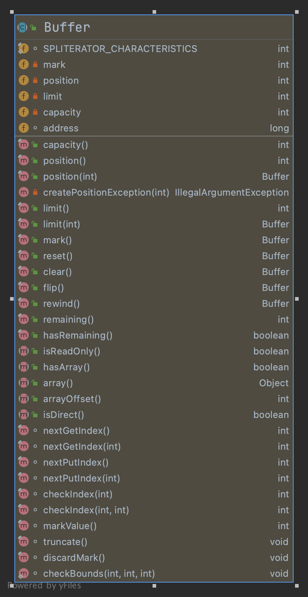

### Buffer类（缓冲区）

概述:
Buffer是一个抽象类，它是对某种基本类型的数组进行了封装。
> 一个用于特定基本类型数据的容器,缓冲区是特定基本类型元素的线性有限序列。除内容外，缓冲区的基本属性还包括容量、限制和位置

    缓冲区的容量 是它所包含的元素的数量。缓冲区的容量不能为负并且不能更改。
    缓冲区的限制 是第一个不应该读取或写入的元素的索引。缓冲区的限制不能为负，并且不能大于其容量。
    缓冲区的位置 是下一个要读取或写入的元素的索引。缓冲区的位置不能为负，并且不能大于其限制。

作用: 在NIO中，就是通过 Buffer 来读写数据的。所有的数据都是用Buffer来处理的，它是NIO读写数据的中转池, 通常使用字节数组。

Buffer主要有如下几种：

    ByteBuffer

    CharBuffer

    DoubleBuffer

    FloatBuffer

    IntBuffer

    LongBuffer

    ShortBuffer

位置标记

    // Invariants: mark <= position <= limit <= capacity
    private int mark = -1;
    private int position = 0;
    private int limit;
    private int capacity;

标记、位置、限制和容量值遵守以下不变式：

> 0 <= 标记 <= 位置 <= 限制 <= 容量

#### 类图

除了访问位置、限制、容量值的方法以及做标记和重置的方法外，此类还定义了以下可对缓冲区进行的操作：

    clear() 
使缓冲区为一系列新的通道读取或相对放置 操作做好准备：它将限制设置为容量大小，将位置设置为 0。

    flip() 
使缓冲区为一系列新的通道写入或相对获取 操作做好准备：它将限制设置为当前位置，然后将位置设置为 0。

    rewind() 
使缓冲区为重新读取已包含的数据做好准备：它使限制保持不变，将位置设置为 0。
